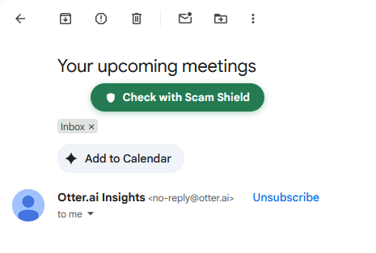
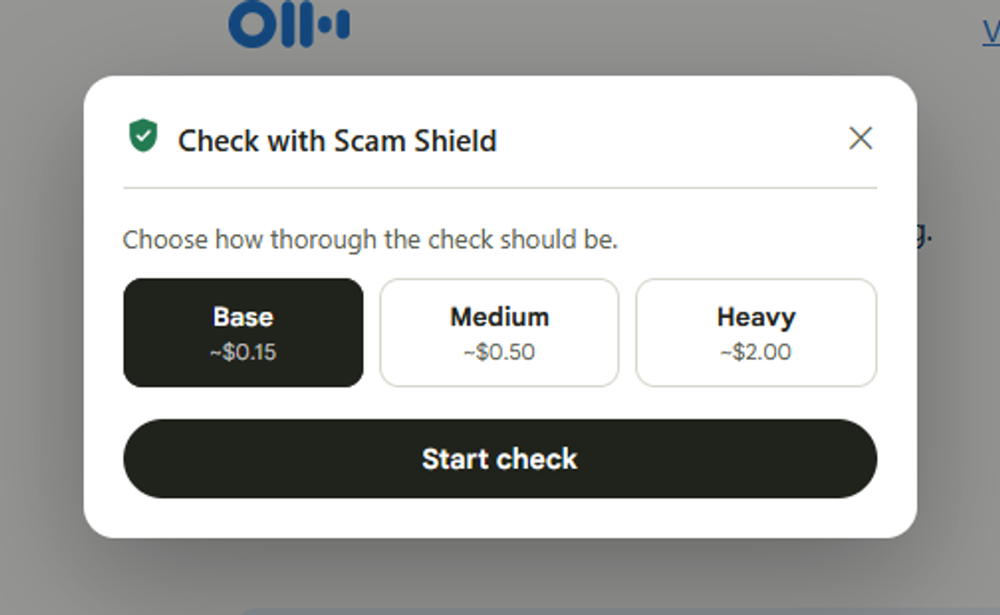
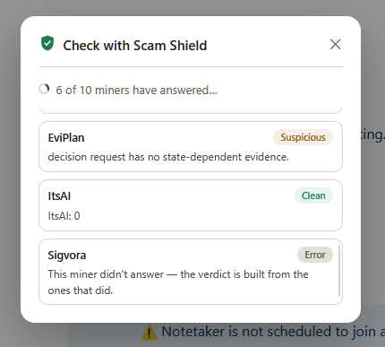
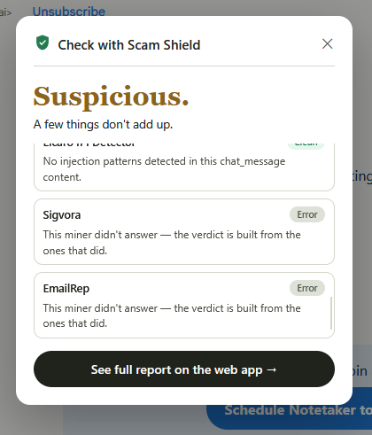

# Scam Shield

**One honest verdict, from twenty places that don't agree on much.**

Paste a suspicious message, email, or link. Scam Shield pays 20+ independent
AI "miners" on the [Telegraph Protocol](https://telegraphprotocol.com)
network - real x402 micropayments, real answers - to check it, then hands
back one plain-language verdict: **Safe**, **Suspicious**, or **Scam**. Every
finding, cost, and cryptographic signal hash is shown in full, not hidden
behind a black-box score.

[](https://nextjs.org)
[](https://www.typescriptlang.org)
[](https://telegraphprotocol.com)
[](https://github.com/x402-foundation/x402)

Scam Shield is three products sharing one verdict engine: a **web app**,
a **Gmail extension**, and an **Android app** - wherever a scam reaches
you, the same live, paid Telegraph miner network checks it and hands
back the same honest verdict.

---

## Why it holds up

- **No single point of failure.** Six independent services check link safety
  alone. When one is slow, wrong, or offline, the scan doesn't wait for it -
  the others still reach a verdict.
- **Nothing is hidden.** Every finding, cost, and signal hash is public and
  independently verifiable on the Telegraph explorer - not a percentage you
  have to trust.
- **Paid, not guessed.** Every answer comes from a service with real money
  riding on being right, settled live via x402 on Base Sepolia.

## Screenshots

**One message in, one honest verdict out**


**A scam caught, with every finding shown**


**Every check, publicly auditable**


**Free during early access - token-based plan coming**


## How it works

1. Paste a message, email, or link.
2. The text is scanned locally for URLs, emails, and IP addresses - free,
   no miner calls yet.
3. Non-English text is translated first, so every downstream check runs on
   English.
4. The raw text always goes through message-fraud, AI-text, and
   prompt-injection miners.
5. Every URL found is checked for link safety and certificate trust, and its
   page content is extracted and re-analyzed too - catching scam landing
   pages even when the message itself looks clean.
6. Every email and IP found gets its own reputation and geolocation checks.
7. Results are rolled into one verdict, streamed to the page live as each
   miner answers, and published to the public ledger with full evidence.

Full technical breakdown: [`app/about`](./app/about/page.tsx).

## Stack

- **Next.js 16** (App Router, Turbopack) + TypeScript + Tailwind CSS v4
- **MongoDB** - persists every scan for the public ledger and stats
- **`@x402/*`** - pays Telegraph miners live via x402 on Base Sepolia

## Setup

1. Install dependencies:

   ```bash
   npm install
   ```

2. Copy the env template and fill it in:

   ```bash
   cp .env.example .env.local
   ```

   | Variable | What it's for |
   |---|---|
   | `EVM_PRIVATE_KEY` | Wallet that pays miners via x402. Must hold USDC on Base Sepolia (`0x036CbD53842c5426634e7929541eC2318f3dCF7e`). Server-only, never sent to the client. |
   | `TELEGRAPH_NODE_URL` | Telegraph node base URL - defaults to the public devnode. |
   | `MONGODB_URI` | A local MongoDB instance works fine for development; use Atlas in production. |
   | `SCAN_SPEND_CEILING_USD` | Safety-net ceiling on spend per scan (default `5.00`). The message-level checks always run regardless of this; it only bounds how many URLs/emails/IPs get the full entity-driven fan-out. |

3. Run the dev server:

   ```bash
   npm run dev
   ```

   Open [http://localhost:3000](http://localhost:3000).

## Requirements

- **Node.js 20+** - the `@x402/*` packages sign payments with the WebCrypto
  API, which Node 18 doesn't expose.
- A funded wallet (see above) - without USDC on the configured wallet, scans
  will run but every miner call will fail at the payment step.

## Scripts

```bash
npm run dev     # start the dev server (Turbopack)
npm run build   # production build
npm run start   # run the production build
npm run lint    # eslint
```

## Project layout

```
app/                 routes (App Router)
  page.tsx           landing page
  check/             the scan tool
  scan/[id]/         permalink verdict page + OG image
  ledger/            public ledger
  pricing/           pricing page
  about/             pipeline + miner directory
  api/               scan, scans, stats route handlers
components/          shared UI (VerdictCard, EvidenceTable, Badge, ...)
lib/telegraph/       miner registry + x402 payment client
lib/scam/            entity extraction, language detection, scan orchestrator
docs/screenshots/    README screenshots
firefox-extension/   Gmail extension - see its own README
mobile-app/           Android app (Kotlin, Jetpack Compose) - see below
```

## Firefox extension

`firefox-extension/` brings the same check straight into Gmail: open an
email, click **Check with Scam Shield**, pick how thorough the check
should be, and watch the same live, miner-by-miner verdict - without ever
leaving your inbox.

**One click, right where the email is**



**Pick how thorough the check should be**



**Watch each miner answer live**



**The same verdict, without leaving the inbox**



### Running it locally

1. Open `about:debugging#/runtime/this-firefox` in Firefox.
2. Click **Load Temporary Add-on…** and select
   [`firefox-extension/manifest.json`](./firefox-extension/manifest.json).
3. Open [mail.google.com](https://mail.google.com) and open any email - the
   button appears just below the subject line.
4. By default it talks to the deployed app
   (`https://scam-shield-rouge.vercel.app`). To point it at a local
   `npm run dev` server instead, edit `API_ORIGIN` / `WEB_APP_ORIGIN` in
   [`firefox-extension/config.js`](./firefox-extension/config.js) to
   `http://localhost:3000` (both lines are already there, just commented
   out).

Temporary add-ons are removed when Firefox closes, so reload it from
`about:debugging` each session while testing. Full architecture notes -
why the modal talks to the background script over a long-lived port
instead of one-off messages, and how it falls back if that connection
drops mid-scan - live in
[`firefox-extension/README.md`](./firefox-extension/README.md).

## Android app

`mobile-app/` brings the same verdict engine to SMS: turn on protection
once, and every incoming text is checked automatically through the same
live, paid Telegraph miner network - no need to open the app. Every
scan, from every device, is also visible in a global ledger tab, not
just your own phone's history.

**Every scanned text, one honest verdict each**


**Flagged the moment it arrives**


**Every miner's answer, not just the headline verdict**


### Installing the APK

A signed release build is checked into the repo at
[`mobile-app/releases/scam-shield-v0.1.0.apk`](./mobile-app/releases/scam-shield-v0.1.0.apk)
and talks to the deployed app by default - no build step needed.

1. Get the APK onto your Android device (download it directly on-device
   from GitHub, or transfer it via USB/`adb push`/a messaging app).
2. Open it from Files/Downloads. Android will prompt to allow installs
   from that source the first time - allow it, then continue the install.
3. Open **Scam Shield**, go to **Settings**, and turn on **Protection**.
   Grant the SMS permission when prompted (and notifications, on Android
   13+) - incoming texts start getting checked automatically from then on.

Prefer the command line: `adb install mobile-app/releases/scam-shield-v0.1.0.apk`
with the device connected over USB (developer options + USB debugging
enabled).

### Building from source

Open `mobile-app/` in Android Studio, let it sync Gradle, and run the
`app` configuration on a device or emulator. It's a native Kotlin/Jetpack
Compose project - no Node tooling involved. SMS scanning is Android-only -
reading incoming SMS content isn't a capability iOS grants to any app.

## Upcoming features

- **More inboxes.** The extension currently checks Gmail; Outlook, Zoho,
  and other webmail providers are next, so the same one-click check works
  wherever you actually read your email.
- **iOS support.** SMS auto-scanning is Android-only for now (iOS doesn't
  allow it); a paste-to-check iOS app is the likely next step.
- **One subscription, every platform.** A single plan that unlocks
  unlimited checks across the web app, the extension, and mobile - the
  [pricing page](https://scam-shield-rouge.vercel.app/pricing) previews
  the tiers today.
