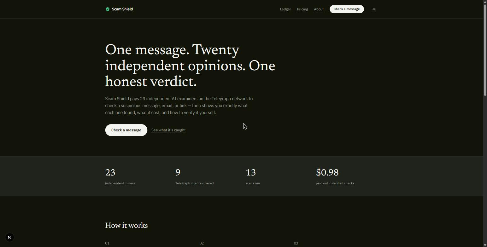
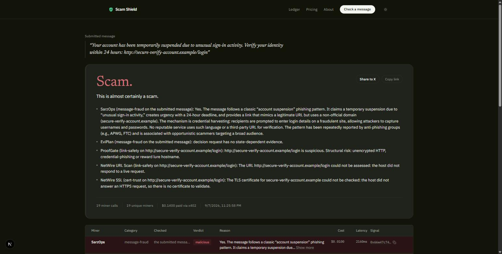
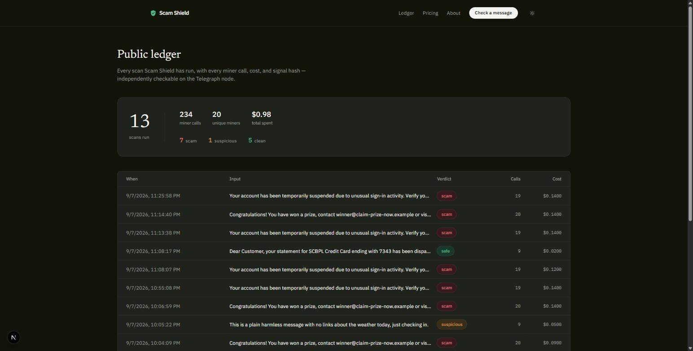
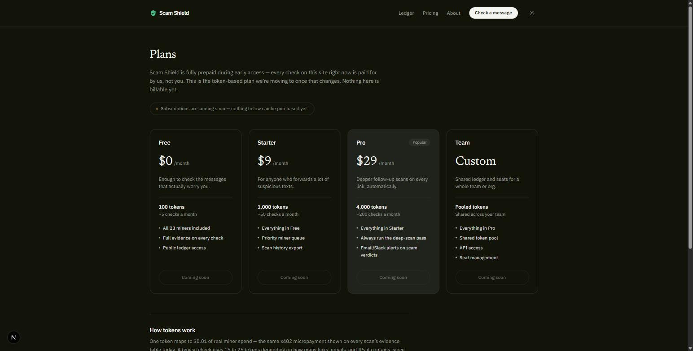

# Scam Shield

**One honest verdict, from twenty places that don't agree on much.**

Paste a suspicious message, email, or link. Scam Shield pays 20+ independent
AI "miners" on the [Telegraph Protocol](https://telegraphprotocol.com)
network — real x402 micropayments, real answers — to check it, then hands
back one plain-language verdict: **Safe**, **Suspicious**, or **Scam**. Every
finding, cost, and cryptographic signal hash is shown in full, not hidden
behind a black-box score.

---

## Why it holds up

- **No single point of failure.** Six independent services check link safety
  alone. When one is slow, wrong, or offline, the scan doesn't wait for it —
  the others still reach a verdict.
- **Nothing is hidden.** Every finding, cost, and signal hash is public and
  independently verifiable on the Telegraph explorer — not a percentage you
  have to trust.
- **Paid, not guessed.** Every answer comes from a service with real money
  riding on being right, settled live via x402 on Base Sepolia.

## Screenshots

**One message in, one honest verdict out**

**A scam caught, with every finding shown**

**Every check, publicly auditable**

**Free during early access — token-based plan coming**

## How it works

1. Paste a message, email, or link.
2. The text is scanned locally for URLs, emails, and IP addresses — free,
   no miner calls yet.
3. Non-English text is translated first, so every downstream check runs on
   English.
4. The raw text always goes through message-fraud, AI-text, and
   prompt-injection miners.
5. Every URL found is checked for link safety and certificate trust, and its
   page content is extracted and re-analyzed too — catching scam landing
   pages even when the message itself looks clean.
6. Every email and IP found gets its own reputation and geolocation checks.
7. Results are rolled into one verdict, streamed to the page live as each
   miner answers, and published to the public ledger with full evidence.

Full technical breakdown: [`web/app/about`](./web/app/about/page.tsx).

## Structure

This is a monorepo. Each package is independent (its own `package.json`,
its own `node_modules`) — there's no shared build tooling between them.

| Package | Status | Description |
|---|---|---|
| [`web/`](./web) | Live | Next.js web app — the scan tool, public ledger, and pricing page. |
| `extension/` | Planned | Browser extension for scanning links/messages inline while browsing. |
| `mobile/` | Planned | Android app for automatic SMS scam detection. |

## Development

Each package has its own README with setup instructions. Start with
[`web/README.md`](./web/README.md).
